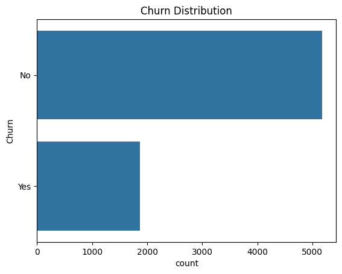
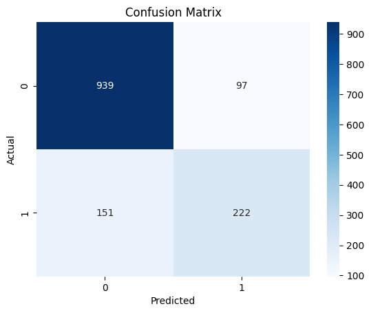
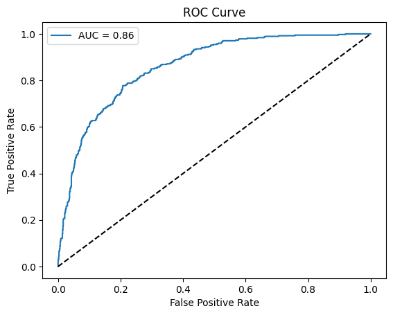

# Jupyter Project

## **Customer Churn Prediction**

## Project Overview
This project aims to develop a machine learning model to predict customer churn in the telecom industry. Using historical customer data, including demographics, service usage, and customer interactions, the goal is to identify customers at risk of leaving and help reduce churn rates.

Purpose & Goals
The main goal is to build a logistic regression model that predicts whether a customer will churn. By doing so, telecom companies can take proactive measures to retain at-risk customers, improving customer satisfaction and reducing the cost of acquiring new customers.

Approach
Data: Sourced from the client's CRM system, including customer demographics, usage, billing, and tenure data.
Method: Logistic regression for binary classification (churn/no churn).
Evaluation: Model performance evaluated with accuracy, precision, recall, F1-score, and ROC curve.

Key Features
Data Cleaning: Removed duplicates, handled missing values, and converted categorical data into numerical format.

Visualizations: Key plots include:
Churn Distribution: Bar plot showing the ratio of customers who churned vs stayed.



Confusion Matrix: Heatmap showing model prediction accuracy.



ROC Curve: Evaluates the model's ability to distinguish between churn and non-churn customers.



Model Evaluation
Accuracy: 82% (successful prediction of churn behavior).
AUC: 0.86 (strong predictive capability).

Benefits
Proactive Retention: Identifies at-risk customers to reduce churn.
Cost Efficiency: Minimizes the need for acquiring new customers.
Customer Satisfaction: Tailored strategies to improve retention.

Future Improvements
Use advanced models like Random Forest or XGBoost.
Include real-time data integration to dynamically predict churn.

## Setup Instructions

1. Clone the repository:
   ```bash
   git clone https://github.com/jnima2022/Customer-Churn-Prediction-Application.git

2. Navigate to the project directory:
    cd Customer-Churn-Prediction-Application

3. Create and activate a virtual environment:
    python -m venv .venv
source .venv/bin/activate  # macOS/Linux
.venv\Scripts\activate  # Windows

4. Install the dependencies:
    pip install -r requirements.txt

5. Open and run the Jupyter notebook:
    jupyter notebook
